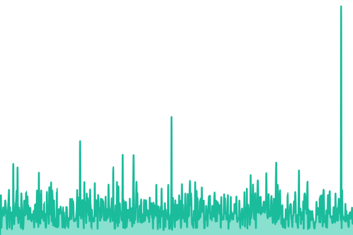
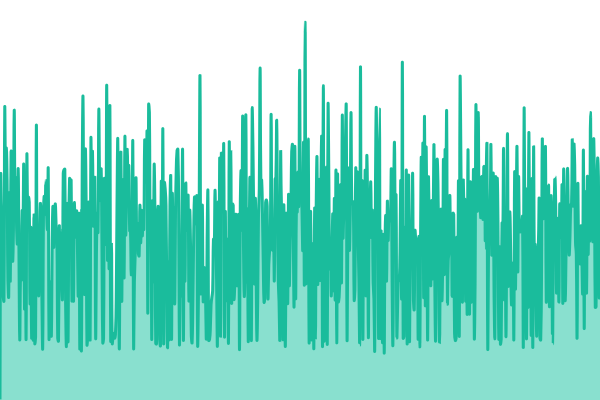
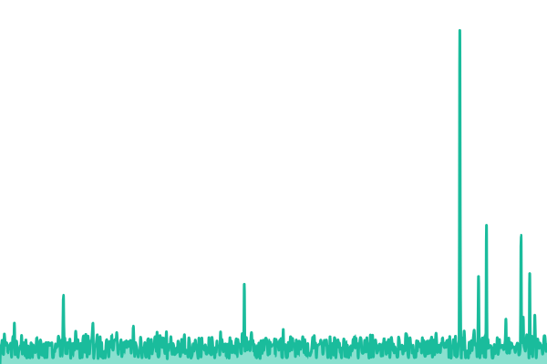
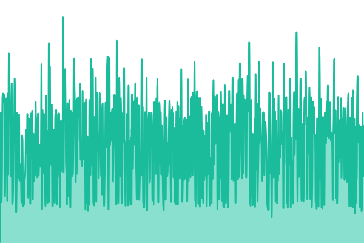
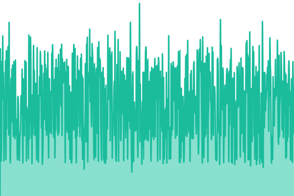
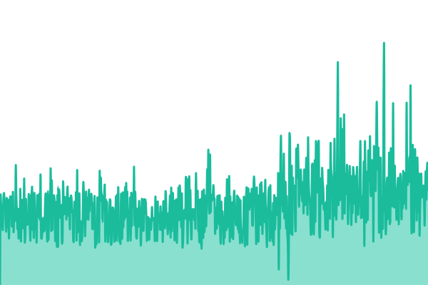
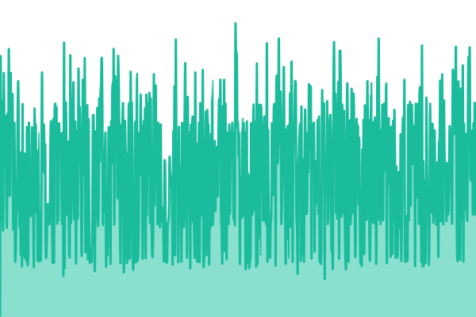

# [📈 Neurometric Status](https://status.neurometric.ai)

This repository contains the open-source uptime monitor and status page for [Neurometric](https://www.neurometric.ai/), powered by [Upptime](https://github.com/upptime/upptime).

<!--start: status pages-->
<!-- This summary is generated by Upptime (https://github.com/upptime/upptime) -->
<!-- Do not edit this manually, your changes will be overwritten -->
<!-- prettier-ignore -->
| URL | Status | History | Response Time | Uptime |
| --- | ------ | ------- | ------------- | ------ |
|  [Website (www)](https://www.neurometric.ai) | 🟩 Up | [website-www.yml](https://github.com/NeurometricAI/status/commits/HEAD/history/website-www.yml) | 

 178ms
     
 | 

<a href="https://status.neurometric.ai/history/website-www">100.00%</a>
    

|  [API Gateway](https://api.neurometric.ai/health) | 🟩 Up | [api-gateway.yml](https://github.com/NeurometricAI/status/commits/HEAD/history/api-gateway.yml) | 

 384ms
     
 | 

<a href="https://status.neurometric.ai/history/api-gateway">100.00%</a>
    

|  [Wharf (Model Gateway)](https://wharf.neurometric.ai/health) | 🟩 Up | [wharf-model-gateway.yml](https://github.com/NeurometricAI/status/commits/HEAD/history/wharf-model-gateway.yml) | 

 242ms
     
 | 

<a href="https://status.neurometric.ai/history/wharf-model-gateway">100.00%</a>
    

|  [SLM Marketplace](https://marketplace.neurometric.ai) | 🟩 Up | [slm-marketplace.yml](https://github.com/NeurometricAI/status/commits/HEAD/history/slm-marketplace.yml) | 

 190ms
     
 | 

<a href="https://status.neurometric.ai/history/slm-marketplace">100.00%</a>
    

|  [TTC Leaderboard](https://leaderboard.neurometric.ai) | 🟩 Up | [ttc-leaderboard.yml](https://github.com/NeurometricAI/status/commits/HEAD/history/ttc-leaderboard.yml) | 

 262ms
     
 | 

<a href="https://status.neurometric.ai/history/ttc-leaderboard">100.00%</a>
    

|  [Task Explorer (Task Router)](https://taskrouter.neurometric.ai) | 🟩 Up | [task-explorer-task-router.yml](https://github.com/NeurometricAI/status/commits/HEAD/history/task-explorer-task-router.yml) | 

 887ms
     
 | 

<a href="https://status.neurometric.ai/history/task-explorer-task-router">100.00%</a>
    

|  [Inference Studio](https://studio.neurometric.ai) | 🟩 Up | [inference-studio.yml](https://github.com/NeurometricAI/status/commits/HEAD/history/inference-studio.yml) | 

 172ms
     
 | 

<a href="https://status.neurometric.ai/history/inference-studio">100.00%</a>
    

<!--end: status pages-->

## License

[MIT](./LICENSE) © [Neurometric](https://neurometric.ai)
